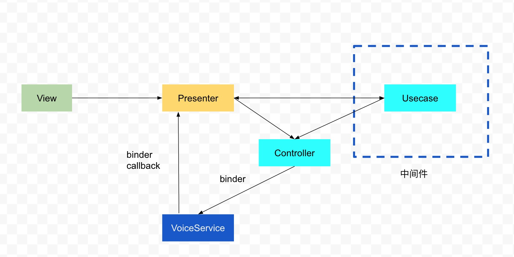

# VoiceAssist Architecture

## 应用架构简述
应用采用 MVC + Service 模式开发。

## 应用具体架构

### View
组成主要有Activity以及其他的显示控件，如RecyclerView.Holder、Adapter、自定义的ScrollView等。

### Controller(Model) 
应用的控制器。起到控制、调度作用。主要负责管理基础组件，与CoreService层进行通信，管理解析结果的分发，界面显示信息的传递等。

### Usecase
具体场景用例。具体动作的实际逻辑操作（如打开APP的具体业务逻辑）

### CoreService
提供语义解析、TTS播报服务，可被其他应用调用。由度秘SDK与SDK监听器组成。与上层通过Binder接口进行通信。

